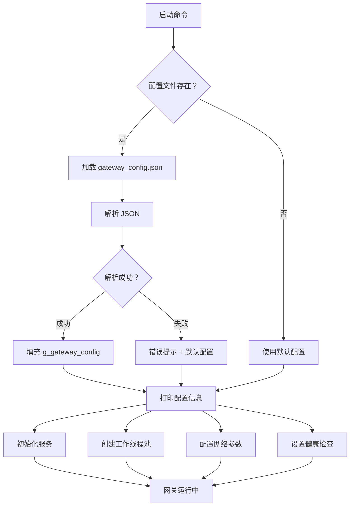
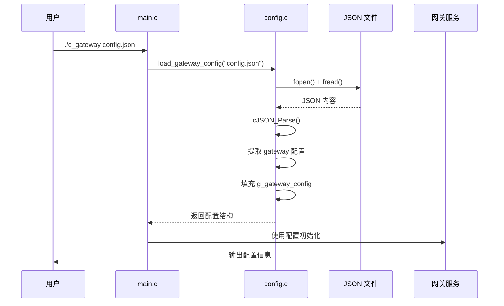
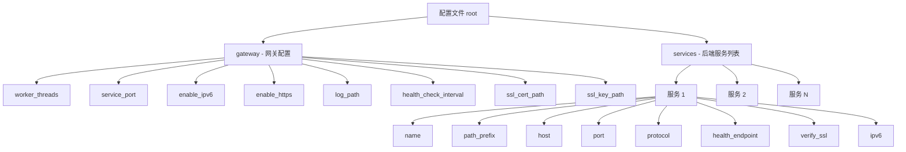
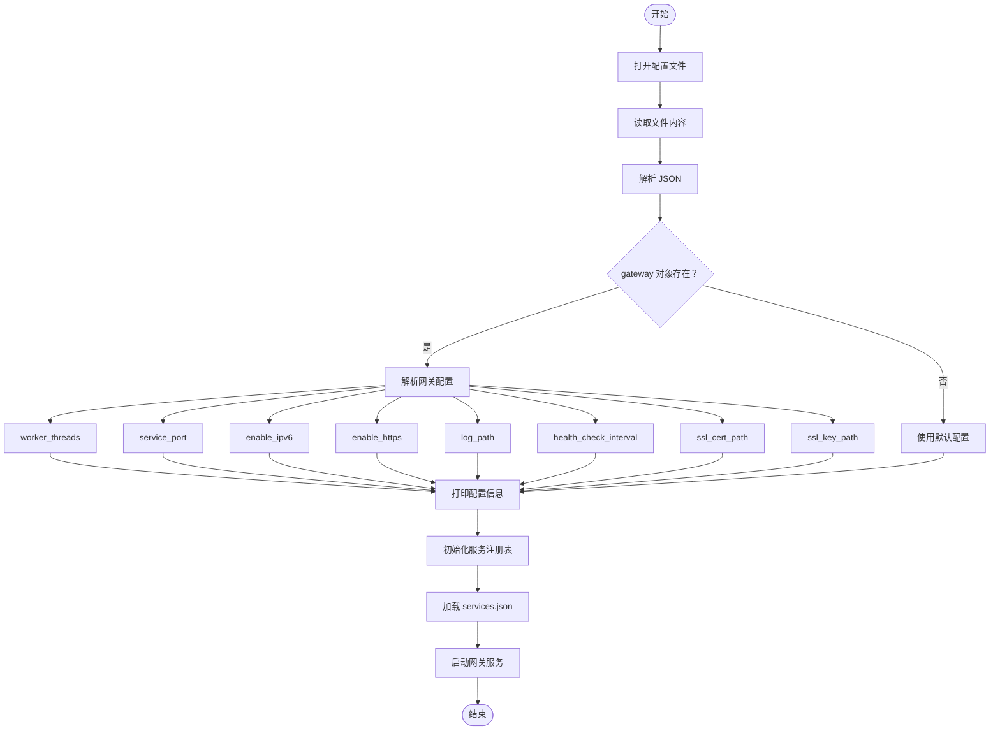
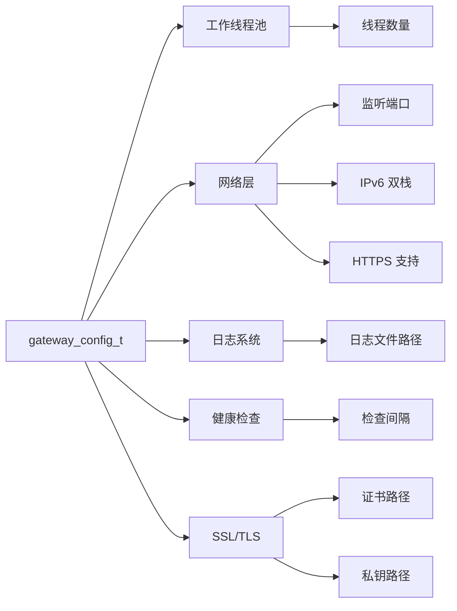
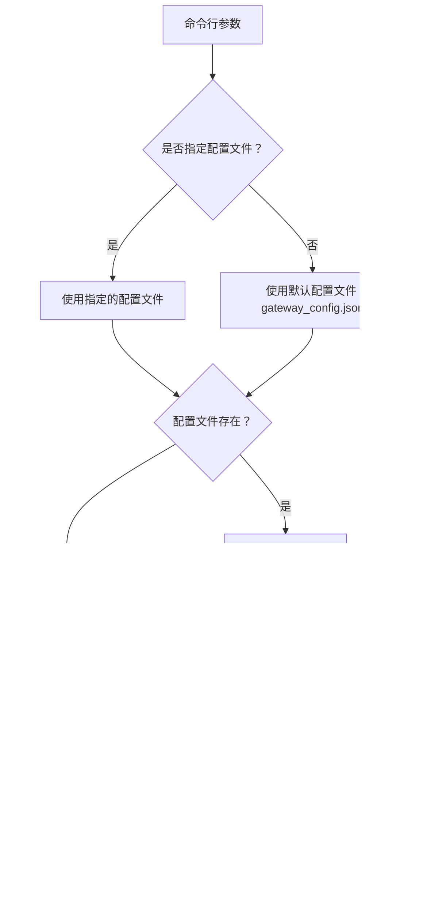
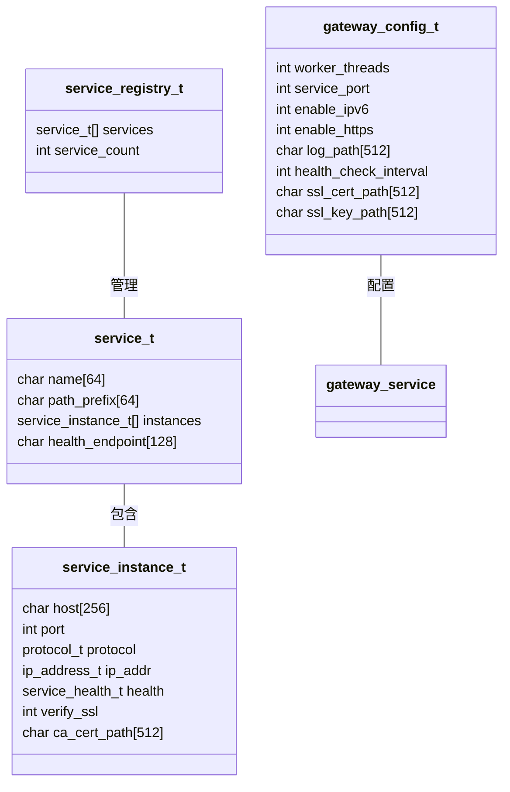
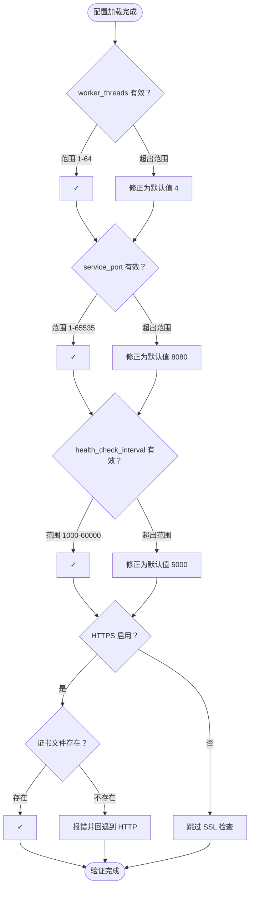
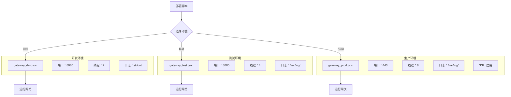
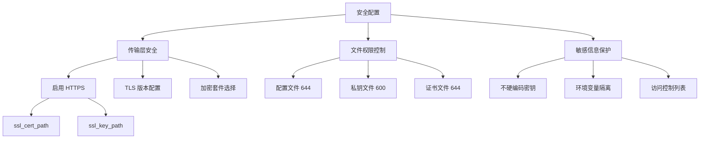

# 网关配置管理架构

## 系统架构图

```mermaid
graph TB
    A[启动命令] --> B{配置文件存在？}
    B -->|是 | C[加载 gateway_config.json]
    B -->|否 | D[使用默认配置]
    
    C --> E[解析 JSON]
    E --> F{解析成功？}
    F -->|成功 | G[填充 g_gateway_config]
    F -->|失败 | H[错误提示 + 默认配置]
    
    G --> I[打印配置信息]
    H --> I
    
    D --> I
    
    I --> J[初始化服务]
    I --> K[创建工作线程池]
    I --> L[配置网络参数]
    I --> M[设置健康检查]
    
    J --> N[网关运行中]
    K --> N
    L --> N
    M --> N
```

## 配置数据流

```mermaid
sequenceDiagram
    participant User as 用户
    participant Main as main.c
    participant Config as config.c
    participant JSON as JSON 文件
    participant Gateway as 网关服务
    
    User->>Main: ./c_gateway config.json
    Main->>Config: load_gateway_config("config.json")
    Config->>JSON: fopen() + fread()
    JSON-->>Config: JSON 内容
    Config->>Config: cJSON_Parse()
    Config->>Config: 提取 gateway 配置
    Config->>Config: 填充 g_gateway_config
    Config-->>Main: 返回配置结构
    Main->>Gateway: 使用配置初始化
    Gateway->>User: 输出配置信息
```

## 配置层次结构

```mermaid
graph TD
    Root[配置文件 root] --> Gateway[gateway - 网关配置]
    Root --> Services[services - 后端服务列表]
    
    Gateway --> WT[worker_threads]
    Gateway --> SP[service_port]
    Gateway --> IPv6[enable_ipv6]
    Gateway --> HTTPS[enable_https]
    Gateway --> Log[log_path]
    Gateway --> Health[health_check_interval]
    Gateway --> Cert[ssl_cert_path]
    Gateway --> Key[ssl_key_path]
    
    Services --> S1[服务 1]
    Services --> S2[服务 2]
    Services --> S3[服务 N]
    
    S1 --> Name[name]
    S1 --> Path[path_prefix]
    S1 --> Host[host]
    S1 --> Port[port]
    S1 --> Proto[protocol]
    S1 --> HealthEP[health_endpoint]
    S1 --> SSL[verify_ssl]
    S1 --> IP6[ipv6]
```

## 配置加载流程

```mermaid
flowchart TD
    Start([开始]) --> OpenFile[打开配置文件]
    OpenFile --> ReadFile[读取文件内容]
    ReadFile --> ParseJSON[解析 JSON]
    
    ParseJSON --> CheckGateway{gateway 对象存在？}
    CheckGateway -->|是 | ParseGateway[解析网关配置]
    CheckGateway -->|否 | UseDefaults[使用默认配置]
    
    ParseGateway --> LoadWT[worker_threads]
    ParseGateway --> LoadSP[service_port]
    ParseGateway --> LoadIPv6[enable_ipv6]
    ParseGateway --> LoadHTTPS[enable_https]
    ParseGateway --> LoadLog[log_path]
    ParseGateway --> LoadHealth[health_check_interval]
    ParseGateway --> LoadCert[ssl_cert_path]
    ParseGateway --> LoadKey[ssl_key_path]
    
    LoadWT --> PrintConfig[打印配置信息]
    LoadSP --> PrintConfig
    LoadIPv6 --> PrintConfig
    LoadHTTPS --> PrintConfig
    LoadLog --> PrintConfig
    LoadHealth --> PrintConfig
    LoadCert --> PrintConfig
    LoadKey --> PrintConfig
    
    UseDefaults --> PrintConfig
    
    PrintConfig --> InitServices[初始化服务注册表]
    InitServices --> LoadSvcConfig[加载 services.json]
    LoadSvcConfig --> StartGateway[启动网关服务]
    StartGateway --> End([结束])
```

## 配置应用点

```mermaid
graph LR
    Config[gateway_config_t] --> WT[工作线程池]
    Config --> Net[网络层]
    Config --> Log[日志系统]
    Config --> Health[健康检查]
    Config --> SSL[SSL/TLS]
    
    WT --> WTCount[线程数量]
    
    Net --> Port[监听端口]
    Net --> IPv6Sup[IPv6 双栈]
    Net --> HTTPSSup[HTTPS 支持]
    
    Log --> LogPath[日志文件路径]
    
    Health --> Interval[检查间隔]
    
    SSL --> CertPath[证书路径]
    SSL --> KeyPath[私钥路径]
```

## 配置优先级

```mermaid
graph TD
    A[命令行参数] --> B{是否指定配置文件？}
    B -->|是 | C[使用指定的配置文件]
    B -->|否 | D[使用默认配置文件 gateway_config.json]
    
    C --> E{配置文件存在？}
    D --> E
    
    E -->|是 | F[加载并解析配置]
    E -->|否 | G[使用所有默认值]
    
    F --> H{配置项存在？}
    H -->|是 | I[使用配置值]
    H -->|否 | J[使用字段默认值]
    
    G --> K[初始化网关]
    I --> K
    J --> K
```

## 数据结构关系

```mermaid
classDiagram
    class gateway_config_t {
        int worker_threads
        int service_port
        int enable_ipv6
        int enable_https
        char log_path[512]
        int health_check_interval
        char ssl_cert_path[512]
        char ssl_key_path[512]
    }
    
    class service_instance_t {
        char host[256]
        int port
        protocol_t protocol
        ip_address_t ip_addr
        service_health_t health
        int verify_ssl
        char ca_cert_path[512]
    }
    
    class service_t {
        char name[64]
        char path_prefix[64]
        service_instance_t[] instances
        char health_endpoint[128]
    }
    
    class service_registry_t {
        service_t[] services
        int service_count
    }
    
    gateway_config_t -- gateway_service : 配置
    service_t -- service_instance_t : 包含
    service_registry_t -- service_t : 管理
```

## 配置验证流程

```mermaid
flowchart TD
    Start([配置加载完成]) --> Validate1{worker_threads 有效？}
    Validate1 -->|范围 1-64 | Pass1[✓]
    Validate1 -->|超出范围 | Fix1[修正为默认值 4]
    
    Pass1 --> Validate2{service_port 有效？}
    Fix1 --> Validate2
    Validate2 -->|范围 1-65535 | Pass2[✓]
    Validate2 -->|超出范围 | Fix2[修正为默认值 8080]
    
    Pass2 --> Validate3{health_check_interval 有效？}
    Fix2 --> Validate3
    Validate3 -->|范围 1000-60000 | Pass3[✓]
    Validate3 -->|超出范围 | Fix3[修正为默认值 5000]
    
    Pass3 --> Validate4{HTTPS 启用？}
    Fix3 --> Validate4
    Validate4 -->|是 | CheckCert{证书文件存在？}
    Validate4 -->|否 | SkipSSL[跳过 SSL 检查]
    
    CheckCert -->|存在 | Pass4[✓]
    CheckCert -->|不存在 | Error[报错并回退到 HTTP]
    
    Pass4 --> Validated([验证完成])
    SkipSSL --> Validated
    Error --> Validated
```

## 多环境配置管理

```mermaid
graph TB
    subgraph 开发环境
        DevConfig[gateway_dev.json]
        DevPort[端口：8080]
        DevThreads[线程：2]
        DevLog[日志：stdout]
    end
    
    subgraph 测试环境
        TestConfig[gateway_test.json]
        TestPort[端口：8080]
        TestThreads[线程：4]
        TestLog[日志：/var/log/]
    end
    
    subgraph 生产环境
        ProdConfig[gateway_prod.json]
        ProdPort[端口：443]
        ProdThreads[线程：8]
        ProdLog[日志：/var/log/]
        ProdSSL[SSL: 启用]
    end
    
    Deploy[部署脚本] --> EnvSelect{选择环境}
    EnvSelect --> |dev| DevConfig
    EnvSelect --> |test| TestConfig
    EnvSelect --> |prod| ProdConfig
    
    DevConfig --> RunDev[运行网关]
    TestConfig --> RunTest[运行网关]
    ProdConfig --> RunProd[运行网关]
```

## 安全配置层级

```mermaid
graph TD
    A[安全配置] --> B[传输层安全]
    A --> C[文件权限控制]
    A --> D[敏感信息保护]
    
    B --> HTTPS[启用 HTTPS]
    B --> TLS[TLS 版本配置]
    B --> Cipher[加密套件选择]
    
    C --> ConfigPerm[配置文件 644]
    C --> KeyPerm[私钥文件 600]
    C --> CertPerm[证书文件 644]
    
    D --> NoHardcode[不硬编码密钥]
    D --> EnvVar[环境变量隔离]
    D --> AccessControl[访问控制列表]
    
    HTTPS --> SSLCert[ssl_cert_path]
    HTTPS --> SSLKey[ssl_key_path]
```

---

**更新日期**: 2026-03-23  
**版本**: v1.0
